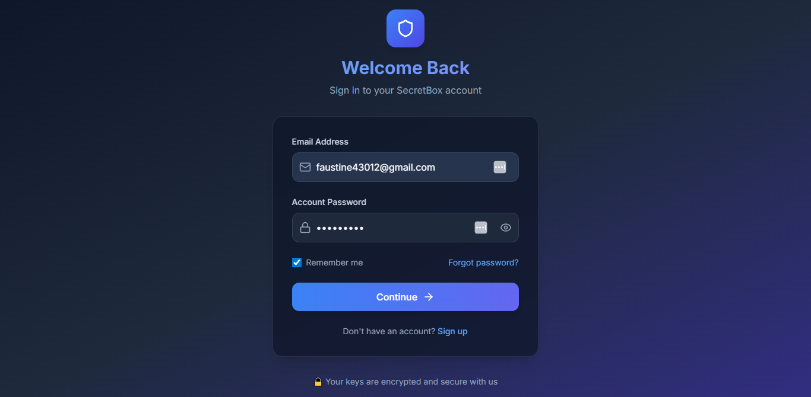

# 🔐 SecretBox - Secure Key Manager

SecretBox is a developer-focused secret key management application that helps developers and teams securely store, organize, and retrieve sensitive credentials such as API keys, tokens, and database credentials. It prioritizes security, usability, and scalability, making it practical for both personal workflows and team collaboration.

---

## ✨ Features

- **Secure User Authentication**: End-to-end authentication with Supabase Auth, including registration, login, and password reset.
- **Server-Side Encryption**: All secrets are encrypted on the server using AES-256-GCM to ensure data is never exposed on the client.
- **Collections-Based Organization**: Group related secrets into collections for better organization and management.
- **CRUD Operations**: Full create, read, update, and delete functionality for both secrets and collections.
- **Audit Logging**: Track all sensitive operations, such as key creation, access, and deletion, for security and compliance.
- **Row Level Security (RLS)**: Fine-grained access control to ensure users can only access their own data.
- **Responsive UI/UX**: A clean and intuitive user interface built with Tailwind CSS for a seamless experience on all devices.

---

## 📸 Screenshots

| Feature | Screenshot |
| --- | --- |
| **Dashboard** |  |
| **Collections View** |  |
| **Key Management** |  |
| **Create/Edit Key** |  |
| **Secure Key Reveal** |  |
| **Audit Log** |  |
| **Register** |  |
| **Responsive Design** |  |
| **Login System** |  |
| **Login System** |  |

---

## 🛠️ Tech Stack

- **Framework**: [Next.js 15.5+ (App Router)](https://nextjs.org/)
- **Styling**: [Tailwind CSS](https://tailwindcss.com/)
- **Forms**: [React Hook Form](https://react-hook-form.com/) + [Zod](https://zod.dev/)
- **Icons**: [Lucide React](https://lucide.dev/)
- **Backend**: Next.js API Routes with Node.js Crypto for encryption
- **Database**: [Supabase](https://supabase.com/) (PostgreSQL)
- **Authentication**: Supabase Auth
- **Testing**: Jest, React Testing Library, and Playwright
- **Deployment**: [Vercel](https://vercel.com/)

---

## 🚀 Getting Started

Follow these instructions to set up the project locally.

### Prerequisites

- [Node.js](https://nodejs.org/en/) (v18 or higher)
- [pnpm](https://pnpm.io/)
- [Supabase Account](https://supabase.com/)

### 1. Clone the Repository

```bash
git clone https://github.com/your-username/secretbox.git
cd secretbox
```

### 2. Install Dependencies

```bash
pnpm install
```

### 3. Set Up Supabase

1.  Create a new project on [Supabase](https://supabase.com/).
2.  Navigate to the **SQL Editor** and run the schemas from the `schemas` directory in the following order:
    - `01_create_user_profiles.sql`
    - `02_create_collections.sql`
    - `03_create_keys.sql`
    - `04_create_audit_logs.sql`
    - `05_rls_policies.sql`
    - `06_triggers.sql`
3.  Navigate to **Project Settings** > **API** and copy your **Project URL** and **anon key**.

### 4. Environment Variables

Create a `.env.local` file in the root of the project and add the following environment variables:

```bash
NEXT_PUBLIC_SUPABASE_URL=your-supabase-project-url
NEXT_PUBLIC_SUPABASE_ANON_KEY=your-supabase-anon-key
ENCRYPTION_KEY=a-secure-32-byte-encryption-key # Must be 32 bytes
```

You can generate a secure 32-byte key using the following command:

```bash
openssl rand -hex 32
```

### 5. Run the Development Server

```bash
pnpm dev
```

The application will be available at `http://localhost:3000`.

---

## 🧪 Running Tests

To run the test suite, use the following command:

```bash
pnpm test
```

---

## 🌐 API Endpoints

- **`POST /api/auth`**: User login
- **`POST /api/auth/register`**: User registration
- **`POST /api/auth/logout`**: User logout
- **`GET /api/collections`**: Get all collections
- **`POST /api/collections`**: Create a new collection
- **`PUT /api/collections/[id]`**: Update a collection
- **`DELETE /api/collections/[id]`**: Delete a collection
- **`GET /api/keys`**: Get all keys
- **`POST /api/keys`**: Create a new key
- **`PUT /api/keys/[id]`**: Update a key
- **`DELETE /api/keys/[id]`**: Delete a key
- **`GET /api/audit`**: Get audit logs

---

## 🤖 Notes on AI Usage

This project was developed with the assistance of AI tools. Here's a summary of the tools and contexts used:

*   **Editor**: The code was written in **Trae IDE**, an editor that integrates with AI models.
*   **AI Assistants**:
    *   **Gemini CLI**: Used for generating code, running commands, and other development tasks.
    *   **Claude AI**: Used for planning and high-level architectural discussions.
    *   **ChatGPT**: Used for generating boilerplate code and documentation.
*   **Code Review**:
    *   **Coderabbitai**: Used for automated code reviews and suggestions.
*   **Context Providers**:
    *   **Context7**: Provided context and documentation for various libraries and frameworks.
    *   **Supabase MCP**: Used for managing the Supabase project and providing context.
*   **Guidelines and Prompts**:
    *   `GEMINI.md`: This file contains the rules and guidelines for the AI assistant's behavior, ensuring code quality, security, and consistency.
    *   `PROMPT.md`: This file contains the prompts used to generate code and features for this project.

---

## 🤝 Contributing

Contributions are welcome! Please open an issue or PR with improvements.

---

## 📜 License

This project is licensed under the MIT License.